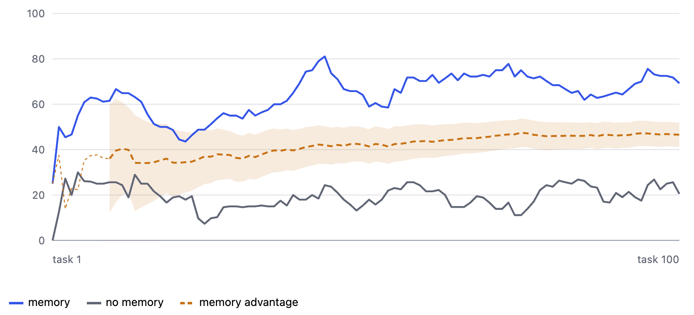

# Learning on the Job

[](https://github.com/memcoai/learning-on-the-job/actions/workflows/ci.yml)

Compounding intelligence, demonstrated: an agent that learns a business's unwritten policies from the corrections its human reviewers make, using the Memco Memory MCP.

On the shipped scenario, a 100-task paired run takes the agent from 20% policy compliance to 64%: a memory advantage of 47 percentage points (95% CI 41–52), measured against a control arm answering the same emails without memory.



This repository is a practical runnable companion to our paper [Learning on the Job](https://arxiv.org/abs/2607.22157), which shows that agents improve at their work when the lessons from each task are captured as memory and reused, with the learning signal coming from processes the business already runs.

## What this repository is for

It serves three purposes, and you can use it for any one of them:

- **A tutorial.** The code shows, end to end, how to build an agent that uses the Memco Memory MCP for the Knowledge Work domain: searching memory while working, and writing back lessons that can be reused.
- **An example harness.** The scenario, tasks, and policies are data, kept apart from the code. You can extend the shipped scenario or replace it with your own domain without touching the harness.
- **A measurement framework.** Every run records what happened per task, renders a learning curve, and includes a no-memory control arm, so the value of memory is measured rather than asserted.

## The idea

Every company runs on know-how that was never written down: which customers get which exceptions, what the person on the next desk would have flagged, the threshold above which someone senior has to look. This knowledge lives in people's heads, and it surfaces every time an experienced colleague corrects a draft before it goes out.

Agent-assisted workflows keep that review step. A request comes in, the agent drafts a response, a person corrects it and sends it on. The corrections are a learning signal that already exists; nobody has to label data or write a policy manual. This harness captures that signal: each correction becomes a lesson stored in Memco memory, and the next time a similar situation appears, the agent applies the lesson instead of repeating the mistake, and requiring the same correction.

## How it works

The scenario is the order desk at Fenmoor Supplies, a fictional B2B distributor. Simulated customers write in about order changes, returns, delivery exceptions, and credit queries. The desk operates on a set of hidden policies, held only by the simulated reviewer, standing in for the tacit knowledge of an experienced team.

Each task runs the same loop:

1. A customer email arrives (drawn from a task library, with the phrasing picked at random from pre-generated variants).
2. The agent drafts a reply. It searches Memco memory twice, once for the situation in the request and once for how such replies are written, and can look up account and order data through a small read-only tool.
3. The reviewer corrects the draft against the hidden policies and records which policies the draft breached.
4. A reflection step turns the corrections into lessons and writes them to memory.

The metric is compliance: the share of the policies that applied to a task that the reply got right. On an empty memory the agent breaches policies it has no way of knowing. As lessons accumulate, compliance climbs. Breach counts are still recorded per task, but a count of two means a good reply on a six-policy task and a poor one on a two-policy task, so the share is what the trend is read from.

## What you will see

The report shows **the learning curve** of compliance climbing as memory fills, with the no-memory control arm flat beside it. The gap between them, the *memory advantage*, is also drawn, with a 95% confidence interval band.

Everything behind that is recorded per task in `results/<run>.jsonl`, one line per episode: what memory returned, the feedback sent back on it, the lessons written, which policies each reply breached, and whether memory had already said so. That is where to start on your own analysis, on your own scenario.

## Quickstart

Requirements: [uv](https://docs.astral.sh/uv/) (which fetches the right Python for you), an LLM provider API key (Anthropic or any OpenAI-compatible endpoint, including Mistral), and a Memco workspace with the Knowledge Work domain enabled.

```bash
uv sync
cp .env.example .env   # add your API keys and Memco MCP details
uv run memco-harness run --tasks 50 --seed 42 --paired
```

One command runs both arms. `--paired` answers every task twice from the same email, once with memory and once blind, printing a line per task as it goes and rewriting `results/<run>.report.html` after each one, so you can watch the run in the terminal or in a browser. The report is complete when the run ends; `uv run memco-harness report --run <run-id>` re-renders it, and prints the fuller analysis to the terminal.

The default 50-task run takes about 50 minutes side by side and shows the story: compliance climbs through roughly the first thirty tasks and settles, while the memory advantage band tightens for the rest of the run. Stop whenever the advantage line has convinced you; the page reads correctly at any point. The library holds 200 tasks over 29 policies, so run 100 or more if you want the rarest policies to recur and the fuller convergence on the curve. Runs are seeded and task order is randomised, so you can convince yourself the effect survives reshuffling.

A note on cost: each task makes a handful of LLM calls (draft, review, reflect), and a paired run makes them twice. Measured on the defaults, a paired task costs about six cents, so the default 50-task paired run is around $3 and a 200-task one around $12. Exact figures depend on your provider and models.

## Extending the harness

Scenarios are YAML: policies, tasks with phrasing variants, and the account and order data behind the lookup tools. The `tools/` directory contains the generator we used to expand policies into task instances; use it to build a scenario from your own domain.

The generator draws policy combinations at random unless you give it an exposure ledger, which is how the shipped library was actually built: `scenario/exposure-ledger.yaml` says how many tasks each policy should appear in, what has to be true of the account and the order for that policy to bite, and which combinations are ruled in or out. It ships because it is the part that is hard to guess at, and its header documents every key. `--dry-run` draws the combinations and reports the ledger without calling a model, which is the cheap way to find out whether your data can carry the quotas you have asked of it.

The reviewer is a self-contained component, so if your team already reviews agent output, that is the seam where this harness maps onto your real workflow.

## Patterns that transfer

We built this harness against our own memory server, and several of its design choices came from watching early runs fail. They apply to any agent working with a shared memory, whatever the scenario, so they are worth stating plainly.

**Search for the situation, and separately for the craft.** Knowledge about work divides into what to decide and how the work is done: thresholds and exceptions on one side, the structure and conventions of the deliverable on the other. A query about the customer's situation never surfaces a lesson about how replies are written, however well that lesson is stored. The agent here runs two searches before drafting: one for the situation in the request, one for the conventions of the work product it is about to produce. In our first memory-on run the agent searched once, and every lesson about the form of the reply sat unread in memory while the same corrections repeated.

**Index a lesson for the search that should find it.** The `query` field on a memory is written from the reader's seat, at the moment of need: a situation-shaped question for lessons about decisions, an activity-shaped question for lessons about the deliverable. This matters enough to get its own section below.

**Scope every lesson.** A lesson states the conditions under which it applies, drawn from the situation that produced it. Two scoped lessons prescribing different behaviour in different circumstances are both correct; the same two lessons unscoped look like a contradiction, attract negative feedback, and erode each other's trust.

**Make the agent read the scope it was written with.** Scoping is half a discipline: the conditions only do their work if the agent applying a lesson checks them. Ours had been told to revise its draft wherever it did not follow a lesson it had retrieved, and an agent under that much compliance pressure stretches a lesson whose conditions almost match, applying a tier-scoped lesson to an account it was never about. So the drafting prompt says a lesson applies only when its stated conditions match the situation in front of it, and that the records looked up for this task take precedence where they differ. The two sentences belong together: asking for compliance without asking for the scope check buys breaches the arm with no memory never made.

**State reasons only when they were given.** Reflection here sees the request, the draft, the correction, and the reviewer's notes. When the reviewer gave a reason, the lesson carries it, because rationale helps a lesson generalise. When no reason was given, the lesson records the behaviour and stops; an invented rationale reads as authority and invites generalising a rule beyond its real footprint.

**Phrase lessons as statements, not instructions.** "Replies from the desk end with the account number" reads correctly whether it is retrieved by a drafting agent, a reviewing agent, or a person browsing the store. "End your replies with the account number" assumes a reader it may not have.

**Tell the control arm only what it can act on.** Both our arms were built from one drafting prompt, so the arm with no memory tool was still instructed to search memory twice, and to check its draft against the lessons it had retrieved. It could do neither. Instructions an arm cannot follow are not harmless: they spend its attention and ask it to weigh knowledge it does not have, and the pair quietly stops being a measurement of memory and becomes a comparison of two prompts, one of them incoherent. The prompt is assembled from blocks now, with the memory sections left out when the tool is absent, so the two arms differ in what they are told by exactly as much as they differ in what they can do.

**Leave provenance to the memory system.** Who contributed a lesson, how often it has been confirmed, and how far it should be trusted are carried by the server as source, endorsements, and trust scores. Lesson text stays about the knowledge.

**Pace writes against reads.** The server processes writes asynchronously, so a lesson written on one task needs a moment before the next task can retrieve it. Human-paced work gets this for free from the natural gaps between tasks; a harness runs tasks back to back, so it reintroduces the gap deliberately. The latency is load-dependent: we measured under five seconds on a quiet workspace and misses well beyond ten during busy runs, so the default gap here is ten seconds between tasks, and the paired control episode adds slack on top. Whether a lesson arrived too late for the task that needed it is answerable from the JSONL: each episode records what its searches returned.

**Treat acknowledged writes as submissions, not facts.** In a governed memory, an acknowledged write is not a permanent one: duplicates merge into endorsements, and the quality gate can decline an entry after the fact. The server surfaces no per-write outcome, and a client cannot enumerate the store, so build nothing that assumes a written lesson exists. What memory holds shows up the only way it can: in what searches return.

## The write/read contract

A memory is only as useful as the searches that can reach it. Writing
and searching are two halves of a single contract: knowledge is
findable when it is indexed under the question its future reader will
ask, phrased in the words that reader will use. The two halves are
usually implemented in separate prompts, written on separate days, and
they drift apart. The drift is invisible until you measure it.

We learned this by breaking it. In an early 100-task run, the agent
breached the same formatting policy in 56 of 92 episodes. Reflection
wrote a lesson after every one: 56 submissions, which the server
correctly consolidated into a handful of memories. The drafting agent,
meanwhile, searched for craft knowledge in nearly every episode, with
a well-formed question about how replies are written at this desk.
Across roughly ninety such searches, those memories came back zero
times. The system had written the cure 56 times and could never hear
itself.

The lessons were correct and clearly written. The failure sat in their
query fields, which reflection had phrased in the voice of a policy
manual: "In correspondence concerning a specific order, the first
sentence names the order number." Nobody asks that question. The
drafting agent asks "how are replies from this desk written and
structured?", and in embedding space a statute and a question about
the same rule can sit far apart. Retrieval matched the phrasing, and
the phrasing belonged to no reader.

The fix is to make the two halves share literal text. The harness
defines two canonical question stems:

- `How are replies from this desk written and structured when <kind
  of reply>?`
- `What applies when a customer <request>, and <circumstances>?`

The drafting prompt fills the stems at search time. The reflection
prompt fills the same stems, verbatim, when it authors each lesson's
query field. Lesson bodies follow the same principle and open in the
reader's moment: "When drafting a reply about a specific order, the
first sentence names the order number." Write and read now meet at
the same point by construction, and because the stems live in one
place in the code, they cannot drift apart again.

The contract exists in any system where one prompt writes and another
reads, whether the store is Memco, a vector database, or files on
disk. The test to apply, whatever your scenario: could the query on
this memory have been typed by the agent that needs it, at the moment
of need? If the answer is no, the memory will sit unread, however
correct its content.

## Links

- Paper: [Learning on the Job](https://arxiv.org/abs/2607.22157)
- Memco: [memco.ai](https://memco.ai)

## Licence

MIT. See [LICENSE](LICENSE).
